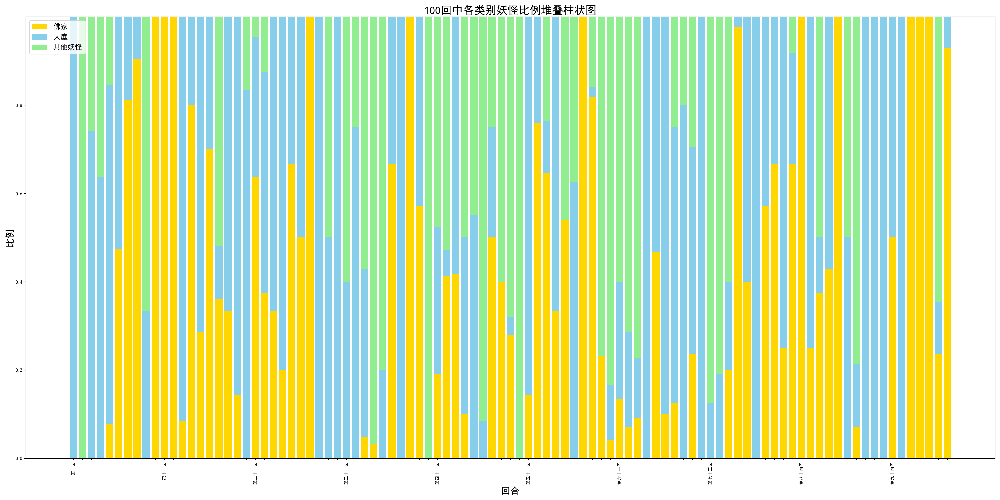

图中显示了《西游记》1-100回中，属于(1)佛家 (2)天庭 (3)其他（天地间自行修炼的妖怪，并非某人的坐骑或童子） 这三种势力角色的出场频率。

表中显示，三种势力的出场频率分布在各回目中并不均匀，佛家、天庭两股势力很少在同一章节内一起出现，而通常分开出现，出现频率也不尽相同。这表明两股势力虽然表面上合作帮助唐僧师徒，但实际上对西行之路有着不同的想法和安排。例如佛家可能为考验金蝉子而深度参与西游，所以在整段西游之路都有出场，并且靠近结尾（灵山）部分频繁出现；而天庭可能为限制孙悟空而参与西游，所以在开头处（大闹天宫）出场较多，而在西行路上出场次数较少。

同时，其他妖怪的出场频率相较另两者更低，这可能也表明西行之路上的考验大多是由佛家或天庭故意安排的，而非简单的“妖怪要吃唐僧肉”所能概括。另外，其他妖怪往往伴随着佛教势力一起出现，这可能说明佛教善于通过教化等方式收服妖怪，扩展自己的势力范围（例如观音收服红孩儿），而天庭则等级较为森严，不会随便收服来路不明的妖怪。
