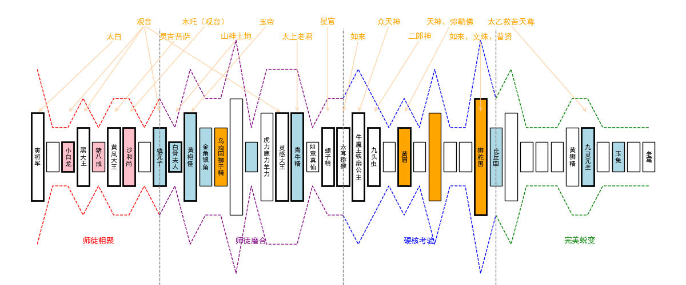
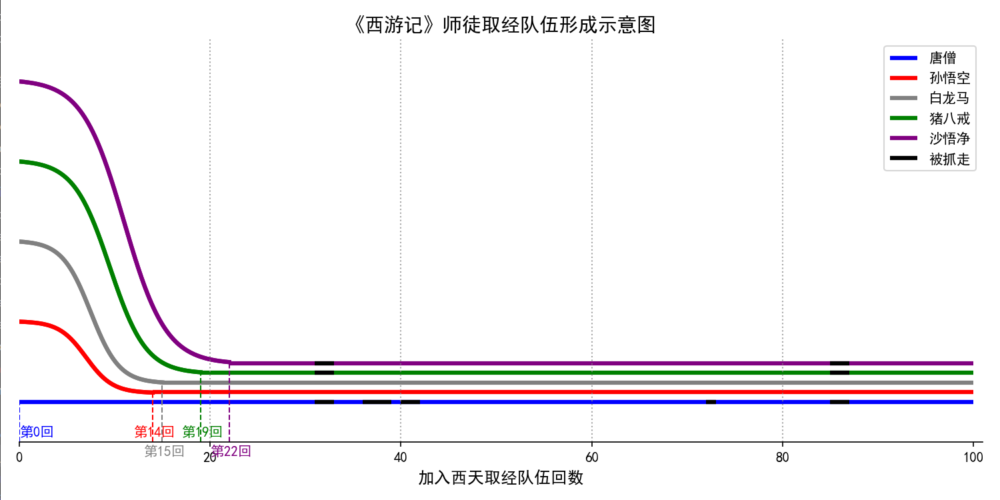

# 西游记可视化

## 介绍

《西游记》是中国古典四大名著之一，由明代作家吴承恩所著。这部小说以唐僧师徒四人西天取经的故事为主线，融合了神话、传说、民间故事等多种元素，展现了一段充满奇幻色彩的冒险旅程。笔者所在小组成员均是《西游记》忠实粉丝，我们对这部小说丰富的想象力和深刻的寓意深深吸引。更重要的是，这不仅是一部文学巨著，也是研究中国古代社会、宗教、哲学和文化的重要文献；不仅反映了作者对当时社会现实的批判和对理想社会的向往，还蕴含着深刻的人生哲理和道德观念。研究《西游记》有助于我们理解中国古代的宗教信仰、文化传统和社会结构，同时也能启发我们对人性、道德和信仰的思考。

在《西游记》中，佛道二派的斗争是一个重要的主题。我组以此为核心线索研究全书，从书中收录数据，使用可视化的方式和技巧，力求展现其中的明争暗斗、讲述清晰的故事。佛教以唐僧师徒取经为主线，展现了佛教的慈悲为怀和普渡众生的理念；而道教则通过各种神仙、妖怪的形象，体现了道教的自然哲学和修炼成仙的追求。小说中的许多情节都隐含着佛道之间的较量和融合，但另一方面，这种斗争并非简单的对立，而是在相互竞争中寻求统一。

## 故事

图一展示了西游记的主要故事线。这幅图以唐三藏从长安出发为起点、渡完81难为终点，按照历经顺序将图中所遇磨难与事件依次排开。一个方块代表一个事件，方块中的汉字即为这一事件的名称，一些并不致命的事件我们略去了它的名字。方块的高度代表这个事件的困难程度——具体来讲，我们使用这一事件对应81难的难数作为衡量指标。从图中可以看出，唐三藏师徒在西行路上遇到了许多困难，这些事件的排列顺序和高度变化，反映了唐三藏师徒在西行路上的艰辛历程。

图中的上下两层虚线是对所有箱子的包络线，它的走势反应了旅途的顺利与否。这条线上下起伏、曲折多变，很有层次，这反应了作者在编排笔墨时的详略区分，
这样的安排使得整本书节奏清晰。这条线以红色、紫色、蓝色、绿色标为了四段，这是全书情节的划分，分别对应了师徒四人取经的四个阶段——“师徒相聚”“师徒磨合”“硬核考验”“完美蜕变”。这四个阶段的划分是根据书中的情节和唐三藏师徒的心理变化来划分的，每个阶段都有一个明显的转折点，这些转折点往往由一些重要事件引发，多是涉及师徒四人与天庭、佛门的或合作或对抗，这些合作和对抗往往富有深意，引发他们师徒四人思考和开悟，带来师徒四人的心理变化。在书中，师徒四人的心理变化是一个重要的线索，它反映了师徒四人在西行路上的成长和蜕变，也是作者对人性和道德的思考。

其中关于师徒四人，我们单独绘制了一张图作为解释。本图展示了师徒四人以及白龙马分别是在哪一个章回参与到的西天取经的路途，并且黑色的线段代表这几个章回中，师徒四人中的某几个人被妖怪抓走了。整个队伍形成示意图展示了西天取经的大致时间线。

回到图一，时间线中的箱子有不同颜色，代表这一事件背后的深意。浅红色的三个事件是取经团队的相遇，蓝色事件代表的是妖怪有天庭相关的势力或背景，橙色时间代表的是妖怪有佛门相关的势力或背景，剩下的白色事件代表的是妖怪与天庭、佛门无关。这样的颜色安排使得我们可以清晰地看到取经团队与天庭、佛门的关系，以及妖怪与天庭、佛门的关系。非常有意思的事情是，取经团队在前半段与天庭的纠纷更为密切，而在后半段与佛门的羁绊更为密切：前者是因为在取经初期，天庭对唐三藏师徒师徒试图阻止，频繁暗中搞小动作，而为了天庭和佛门的明面友好，这种阻挠很有分寸；而当天庭发现这个团队实力不凡、不好对付时，便不再奢求阻止他们。而后半段，佛门对唐三藏师徒的考验更为严苛，这是因为佛门对唐三藏师徒的期望更高，希望他们能够真正成佛，所以佛门对唐三藏师徒的考验更为严苛，这也是佛门对唐三藏师徒的一种期望。当然佛门和天庭也不只有阻挠，本图上方黄色颜色的文字，反应的是这些磨难天庭和佛教插手相助的情况，我们列出了所有帮助过取经团队的人，并指明了他们在何时出手。

对于妖怪的背景，我们还有更深入的分析。图二展示了100回内出现的所有怪物，属于(1)佛家 (2)天庭 (3)其他（天地间自行修炼的妖怪，并非某人的坐骑或童子） 这三种势力角色的出场频率。表中显示，三种势力的出场频率分布在各回目中并不均匀，佛家、天庭两股势力很少在同一章节内一起出现，而通常分开出现，出现频率也不尽相同。这表明两股势力虽然表面上合作帮助唐僧师徒，但实际上对西行之路有着不同的想法和安排。例如佛家可能为考验金蝉子而深度参与西游，所以在整段西游之路都有出场，并且靠近结尾（灵山）部分频繁出现；而天庭可能为限制孙悟空而参与西游，所以在开头处（大闹天宫）出场较多，而在西行路上出场次数较少。

同时，其他妖怪的出场频率相较另两者更低，这可能也表明西行之路上的考验大多是由佛家或天庭故意安排的，而非简单的“妖怪要吃唐僧肉”所能概括。另外，其他妖怪往往伴随着佛教势力一起出现，这可能说明佛教善于通过教化等方式收服妖怪，扩展自己的势力范围（例如观音收服红孩儿），而天庭则等级较为森严，不会随便收服来路不明的妖怪。

同样值得推敲的是，很多与佛派或天庭相关的妖怪，也并非他们二者本意。无论是天庭还是佛派，内部也是势力纵横、派系林立，不同的派系之间也会有矛盾和冲突。这种矛盾和冲突，往往会反映在妖怪身上，他们往往是这些势力的棋子，被利用来对付对方，或者被利用来对付取经团队。这种利用和被利用的关系，使得妖怪的身份和立场变得复杂，他们往往不是单纯的恶人，而是受到了外部势力的影响，或者是被迫为了生存而与取经团队对抗。这种复杂的关系，使得取经团队在西行路上的困难更加复杂，也使得取经团队在西行路上的成长更加丰富。然而，这种分析超过了我们的数据范围，我们无法对这些妖怪的身份和立场进行深入的分析，这是我们研究的一个不足之处。

除了将妖怪、取经队伍、天庭和佛门分开来看，我们从另外一个角度考虑了这个问题：把全书的所有人物作为整体来看。西游记人物关系图展示了三个派别“佛家’“天庭”和“其它”的人物关系，我们可以发现，天庭和佛家之间的关系较为稀疏，这也进一步阐明了佛家和天庭两股势力有对立关系，道家与佛家之间相互斗争的结论。另外，其它妖怪相对而言与佛家的关系更为密切，也表明佛家作为三界中守护秩序的存在，善于用教化来归化妖怪，维护自身的势力与地位。

## 结论

综上所述，通过对《西游记》中佛道二派斗争的可视化分析，我们不仅能够更清晰地理解唐僧师徒在西行路上的艰辛历程和心理变化，还能揭示出佛道两派在取经路上的明争暗斗和相互融合。通过对主要故事线、时间线、妖怪背景和人物关系的深入研究，我们发现了佛道两派在取经过程中的不同策略和安排，以及它们对唐僧师徒的深远影响。这些分析不仅丰富了我们对《西游记》这部经典作品的理解，也为我们提供了新的视角去思考人性、道德和信仰的复杂性。希望通过这篇报告，能够激发更多人对《西游记》的兴趣和研究热情，进一步探索这部伟大作品中的深刻内涵。